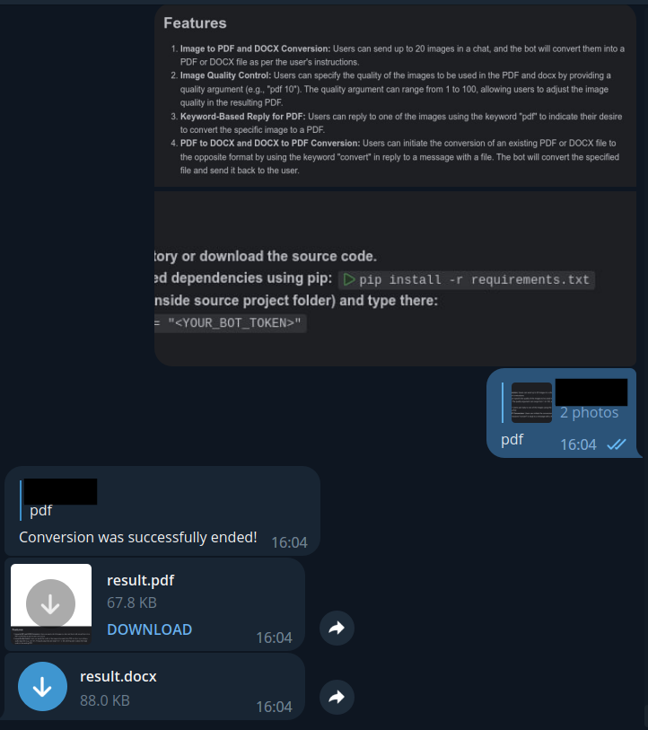
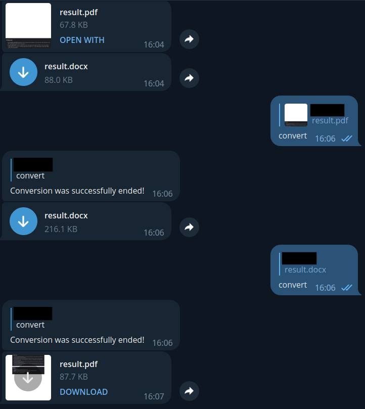

# Telegram Bot for PDF and DOCX conversion

---

## Overview
This Telegram bot is designed to facilitate the conversion of images to PDF and DOCX files. Users can send up to 20 images to the bot, and the bot will allow conversion to PDF or DOCX format based on user instructions. Additionally, users can convert existing PDF and DOCX files to the opposite format through specific commands.

## Features

1. **Image to PDF and DOCX Conversion:**
   Users can send up to 20 images in a chat, and the bot will convert them into a PDF or DOCX file as per the user's instructions.

2. **Image Quality Control:**
   Users can specify the quality of the images to be used in the PDF and docx by providing a quality argument (e.g., "pdf 10"). The quality argument can range from 1 to 100, allowing users to adjust the image quality in the resulting PDF.

3. **Keyword-Based Reply for PDF:**
   Users can reply to one of the images using the keyword "pdf" to indicate their desire to convert the specific image to a PDF.

4. **PDF to DOCX and DOCX to PDF Conversion:**
   Users can initiate the conversion of an existing PDF or DOCX file to the opposite format by using the keyword "convert" in reply to a message with a file. The bot will convert the specified file and send it back to the user.

## Requirements
- Python 3.11
- Telegram Client
- Telegram Bot Token

## Setup
1. **Clone the repository or download the source code.**
2. **Install the required dependencies using pip:** ```pip install -r requirements.txt```
3. **Create *.env* (file inside source project folder) and type there:**
   - ```BOT_TOKEN = "<YOUR_BOT_TOKEN>"```

## Usage
Run the program by executing the main script: ```python3 main.py```

## Examples

Example of usage of `pdf` keyword. Also, you can use one argument to reduce image quality.

---
Example of usage of `convert` keyword.
